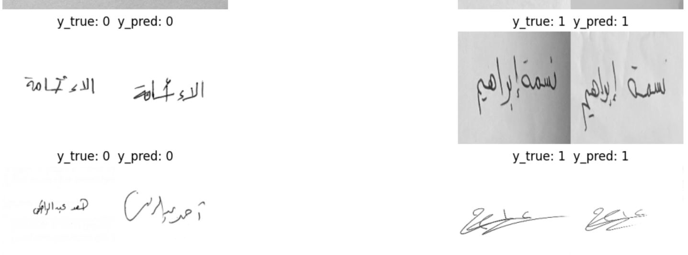

# Arabic Signature Verification

## Introduction:

In this project, we aim to verify whether two signatures are
identical or different and may be used to identify forged handwritten signatures.

## Libraries used:

- Kgit eras
- Scikit-learn
- Pandas
- Numpy

